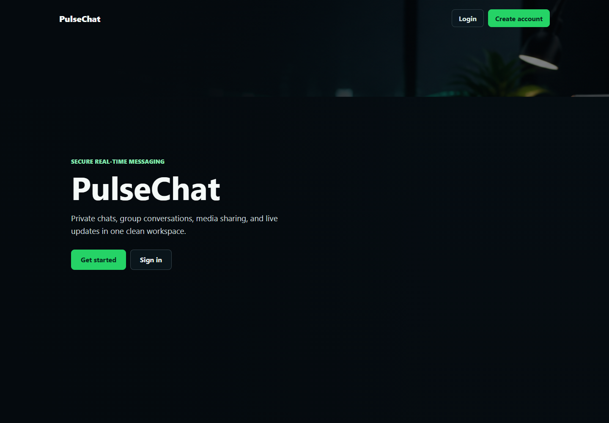

# JWT WebSocket Chat App

A full-stack real-time chat application built with Spring Boot, React, PostgreSQL, JWT authentication, and STOMP/WebSocket messaging.

## Project Overview

This is my individual full-stack project that I built to practice real application features around secure authentication, profile management, database-backed messaging, file uploads, and real-time communication. The main use case is a chat system where users can register, verify their email, log in securely, manage their profile, send private messages, create group chats, share media, and receive real-time chat updates.

I kept the project focused on features that usually appear in production-style applications: REST APIs, layered backend structure, JWT-based security, PostgreSQL persistence, WebSocket events, frontend protected routes, and reusable UI components. The project is not just a static chat UI; the frontend, backend, database, authentication, and real-time layers are connected together.

## Project Report and Screenshots

I added a project report PDF and a PDF copy of the current landing page screenshot. The older full overview PDF is also linked here because it includes the longer UI walkthrough and feature notes.

- [View Project Report PDF](./docs/project-report.pdf)
- [View Full Project Overview_and_UI_Screenshorts PDF](./docs/pulsechat-project-overview-with-landing.pdf)
- [PulseChat landing page UI](./docs/landing-page-ui.png)

### PulseChat Landing Page



## Tech Stack

| Layer | Technologies |
| --- | --- |
| Frontend | React 19, Vite, React Router DOM, Redux Toolkit, React Redux, Axios, custom CSS |
| Backend | Java 25, Spring Boot 4.0.3, Spring Web MVC, Spring Security, Spring WebSocket, Spring Data JPA, Spring Validation, Spring Mail |
| Database | PostgreSQL, Hibernate/JPA |
| Authentication | JWT with JJWT, HttpOnly cookies, refresh token cookie, BCrypt password hashing, Spring Security |
| Real-time | Spring WebSocket, STOMP, SockJS, SimpMessagingTemplate |
| File Storage | Local filesystem uploads with database metadata |
| Tools | Maven, npm, Vite, Git |

## Key Features

- **User Registration and Email Verification** - Users register with username, display name, email, and password, then verify the account using an email OTP before logging in.
- **Login with JWT Session Handling** - The backend creates access and refresh tokens, sets HttpOnly cookies, and returns the access token for API and WebSocket usage.
- **Forgot Password Flow** - Users can request a password reset OTP, verify it, and set a new password.
- **Profile Management** - Users can view and update profile details, upload profile photos and cover photos, change passwords, and delete their account with password confirmation.
- **Private Chat** - Users can send one-to-one text and media messages, reply to messages, mark messages as read, and delete messages for themselves or for everyone.
- **Group Chat** - Users can create groups, add members, leave groups, update group details, manage group roles, send group messages, and view group members.
- **Group Polls** - Group members can create polls, vote on options, and receive updated poll results through real-time events.
- **Real-time Updates** - STOMP/WebSocket is used for private messages, group messages, typing indicators, presence updates, message seen events, poll updates, and group events.
- **Media Uploads** - The backend supports profile, cover, group, chat image, and chat video uploads with validation and stored file metadata.
- **Search and User Discovery** - The frontend can search users through the backend user search API.
- **Responsive Chat UI** - The frontend includes chat sidebars, private/group mode switching, message bubbles, media previews, group drawers, and chat wallpaper selection.

## Advanced Features

- **JWT Authentication with Access and Refresh Tokens**
  I implemented access and refresh token generation using JJWT. Access tokens are used for protected API requests, while refresh tokens are stored separately and used to request a new access token.

- **HttpOnly Cookie Session Support**
  The backend sets the access token and refresh token as HttpOnly cookies with `SameSite=Lax`. The current local development configuration uses `secure(false)`, so this should be changed to secure cookies when deploying over HTTPS.

- **Refresh Token Protection**
  The JWT service includes a token `type` claim. The authentication filter rejects refresh tokens for normal API authentication, so refresh tokens cannot be used as access tokens.

- **Protected Backend APIs**
  Spring Security protects all routes by default except public auth, OTP, forgot-password, WebSocket handshake, and public upload paths for profile, cover, and group images.

- **Frontend Protected Routes**
  React Router uses a `ProtectedRoute` component to block unauthenticated users from accessing chat, profile, edit profile, and settings pages.

- **Email OTP Verification**
  OTP codes are generated with `SecureRandom`, stored as BCrypt hashes in `auth_otp_tokens`, and sent through Spring Mail. The OTP flow includes expiry time, resend cooldown, and resend limits.

- **Forgot Password with Verified OTP**
  Password reset requires the OTP to be verified first. After a successful reset, the forgot-password OTP is invalidated so it cannot be reused.

- **Password Update and Account Deletion Security**
  Profile password updates require the current password and reject a new password that matches the old one. Account deletion requires password confirmation and clears auth cookies after the backend soft-deletes the user.

- **Soft Delete for Users**
  Account deletion marks the user as deleted, anonymizes username and email fields, disables email verification, and keeps relational data safe from foreign-key issues.

- **Real-time Private Messaging**
  Private messages are persisted through REST APIs and then published to both sender and receiver using `convertAndSendToUser` on `/user/queue/private-messages`.

- **Real-time Group Messaging**
  Group messages are published to `/topic/group/{groupId}`. The frontend subscribes to each active group topic and updates the UI without a manual refresh.

- **Typing and Presence Events**
  Typing events are sent through `/app/typing/private` and `/app/typing/group`. Presence is updated on WebSocket connect/disconnect events and broadcast through `/topic/presence`.

- **Group Role Rules**
  Group-level `ADMIN` and `MEMBER` roles are enforced inside the group service. Admin checks are used for actions such as adding members, removing members, updating group profile details, and changing member roles.

- **Group Polls with Real-time Updates**
  Polls are stored using `group_polls`, `group_poll_options`, and `group_poll_votes`. Voting updates are published to `/topic/group/{groupId}/polls`.

- **Message Replies, Mentions, and Seen Status**
  Private and group messages support reply references. Group messages also support seen tracking through `group_message_seen`, and the frontend highlights mentions and reply-related real-time alerts.

- **File Upload Validation and Access Control**
  Uploads are validated by category, extension, and size. Public profile, cover, and group images are served through `/uploads/...`, while private chat media is served through a protected file endpoint after access checks.

- **Layered Backend Structure**
  The backend is separated into controllers, DTOs, services, repositories, entities, security classes, configuration classes, and shared exception/response utilities.

- **API Error Handling**
  `GlobalExceptionHandler` converts validation errors, bad requests, missing resources, access errors, and unexpected failures into consistent API responses.

- **Frontend API Handling**
  Axios is configured with `withCredentials: true`. It also retries protected requests once through `/auth/refresh-token` when a request fails with `401`.

- **Environment-based Configuration**
  Backend settings are kept in `application.properties`, and the frontend reads `VITE_API_BASE_URL` when provided. This keeps local API URLs and secrets separate from source code when configured properly.

## System Architecture

```txt
User
  |
  v
React Frontend
  |
  | HTTP requests with Axios
  v
Spring Boot REST Controllers
  |
  v
Service Layer / Business Logic
  |
  v
Spring Data JPA Repositories
  |
  v
PostgreSQL Database
```

### Authentication Flow

```txt
Register
  -> Backend creates user with emailVerified=false
  -> Backend creates hashed OTP record
  -> Spring Mail sends OTP
  -> User verifies OTP
  -> Login allowed only after email verification
  -> Backend issues access token + refresh token
  -> Tokens are also set as HttpOnly cookies
```

### Protected Request Flow

```txt
Frontend protected page
  -> Axios sends request with credentials and access token
  -> JwtAuthFilter validates token
  -> CurrentUserService loads active non-deleted user
  -> Controller calls service logic
  -> Repository reads/writes PostgreSQL
  -> API response returned to frontend
```

### Real-time Flow

```txt
React STOMP Client
  -> SockJS connection to /ws
  -> WebSocketAuthChannelInterceptor validates Bearer token on CONNECT
  -> Frontend subscribes to user queues and group topics
  -> Backend publishes events with SimpMessagingTemplate
  -> UI updates messages, typing status, presence, seen state, polls, and group alerts
```

### Upload Flow

```txt
User selects image/video
  -> Frontend sends multipart/form-data
  -> Backend validates file type and size
  -> File is saved under uploads/
  -> Stored file metadata is saved in PostgreSQL
  -> Public or protected file URL is returned
```

## Folder Structure

```txt
jwt-websocket-chat-app/
|
|-- backend/
|   |-- pom.xml
|   |-- src/main/java/com/yourname/chatapp/
|   |   |-- auth/              # Auth controllers, DTOs, OTP entity, JWT security, auth services
|   |   |-- chat/              # Chat APIs, private chat, group chat, realtime chat services
|   |   |-- common/            # Shared enums, exceptions, API response wrapper, utilities
|   |   |-- config/            # Security, CORS, WebSocket, web resource configuration
|   |   |-- media/             # Basic media metadata endpoint
|   |   |-- message/           # Legacy/simple chat-room message API
|   |   |-- notification/      # Notification entity, repository, service, controller
|   |   |-- profile/           # Profile, password update, account deletion logic
|   |   |-- security/          # Current authenticated user resolver
|   |   |-- upload/            # File upload validation, storage, metadata, protected file access
|   |   |-- user/              # User entity, repository, search, profile-related user APIs
|   |   |-- websocket/         # Legacy WebSocket message controller/service
|   |   |-- ChatAppApplication.java
|   |-- src/main/resources/
|   |   |-- application.properties
|   |-- uploads/              # Local runtime uploads when backend is run from backend/
|
|-- frontend/
|   |-- package.json
|   |-- package-lock.json
|   |-- vite.config.js
|   |-- index.html
|   |-- src/
|   |   |-- api/               # Axios client and API wrappers
|   |   |-- assets/            # Chat wallpaper and landing page assets
|   |   |-- components/        # Chat, group, common, and layout components
|   |   |-- config/            # API and WebSocket base URL config
|   |   |-- context/           # Auth and socket contexts
|   |   |-- features/          # Auth, chat, profile, and settings feature folders
|   |   |-- hooks/             # Custom hooks
|   |   |-- pages/             # Landing, chat, profile, edit profile, view profile pages
|   |   |-- routes/            # React Router route setup
|   |   |-- services/          # Frontend service wrappers for chat/group/profile APIs
|   |   |-- store/             # Redux store
|   |   |-- styles/            # Global, chat, and landing CSS
|   |   |-- utils/             # Validators and formatting helpers
|   |   |-- websocket/         # STOMP/SockJS client
|
|-- docs/
|   |-- project-overview.pdf
|   |-- project-report.pdf
|   |-- pulsechat-ui-screenshot.pdf
|   |-- landing-page-ui.png
|
|-- uploads/                  # Local runtime uploads when app is run from repo root
|-- .gitignore
|-- README.md
```

## Backend Overview

The backend is a Spring Boot application that handles authentication, profile management, messaging, group logic, uploads, realtime events, and PostgreSQL persistence. I organized it into feature-based packages so each area has its own controllers, DTOs, services, repositories, and entities.

Controllers expose the REST API and keep request handling thin. Most of the actual logic is inside service classes such as `AuthService`, `AuthOtpService`, `ProfileServiceImpl`, `PrivateChatServiceImpl`, `GroupChatServiceImpl`, and `FileUploadService`. Database access is handled through Spring Data JPA repositories.

Spring Security is configured as stateless. Public endpoints are limited to registration, login, OTP verification, forgot-password actions, token refresh, logout, WebSocket connection setup, and public upload paths. Everything else requires authentication.

The backend also includes WebSocket/STOMP support. `WebSocketConfig` exposes `/ws`, enables `/topic` and `/queue`, and uses `/app` for client messages. `WebSocketAuthChannelInterceptor` validates the Bearer token during STOMP connect so user queues can be used for private realtime events.

Error handling is centralized through `GlobalExceptionHandler`, which returns consistent API responses instead of exposing raw stack traces to the frontend.

## Frontend Overview

The frontend is a React/Vite application. I used React Router for page routing, Redux Toolkit for auth/chat/profile state, Axios for API calls, and STOMP/SockJS for the realtime connection.

The main routes are:

- `/login`
- `/register`
- `/verify-email`
- `/forgot-password`
- `/reset-password`
- `/chats`
- `/profile`
- `/profile/edit`
- `/profile/:userId`
- `/settings`

Protected pages use `ProtectedRoute`, which redirects unauthenticated users back to login. The auth state is initialized from local storage, and the Axios client uses credentials plus the access token when available.

The chat UI includes private and group modes, user search, conversation loading, group creation, group member management, group settings, message replies, mentions, media upload previews, group polls, seen information, typing indicators, presence updates, and chat wallpaper selection. The full visual walkthrough is included in the project overview PDF.

## Database Overview

The project uses PostgreSQL with Spring Data JPA and Hibernate. The database connection is configured in `backend/src/main/resources/application.properties`, and the current local configuration uses `spring.jpa.hibernate.ddl-auto=update`.

Main entities include:

- `users` - Stores account, profile, role, email verification, online, last seen, and soft delete data.
- `auth_otp_tokens` - Stores hashed OTP values for email verification and forgot-password flows.
- `private_messages` - Stores private chat messages, sender/receiver relationships, reply references, read state, media URL, and deletion flags.
- `group_chats` - Stores group metadata such as name, description, image URL, creator, and created time.
- `group_members` - Stores group membership with `ADMIN` and `MEMBER` roles.
- `group_messages` - Stores group messages, media URLs, reply references, message type, and created time.
- `group_message_seen` - Stores which group members have seen each group message.
- `group_polls`, `group_poll_options`, `group_poll_votes` - Store group poll questions, options, and user votes.
- `stored_files` - Stores uploaded file metadata, file path, URL, category, content type, size, and access type.
- `chats`, `messages`, `media_files`, `notifications` - Existing simple/legacy chat, media metadata, and notification-related tables.

The richer chat features mainly use the private chat, group chat, group poll, upload, user, and OTP entities.

## Authentication & Security

Registration creates a user with `emailVerified=false`, hashes the password with BCrypt, and sends an email verification OTP. Login is blocked until the email is verified.

Login creates an access token and refresh token. The backend sets both as HttpOnly cookies, while the frontend also stores the access token so Axios and the STOMP client can send a Bearer token. The refresh token is not exposed in JavaScript through the response body.

The JWT filter supports both Authorization headers and the configured access-token cookie. It validates the token, rejects refresh tokens for normal API authentication, loads the user through `CustomUserDetailsService`, and sets the Spring Security context.

Forgot-password uses a separate OTP purpose. The OTP is verified first, then the password reset endpoint checks that verified OTP before saving the new BCrypt password.

Password change requires the current password. Account deletion also requires the current password and clears both auth cookies after the backend soft-deletes the account.

Spring Security includes role handling through `ROLE_USER` / `ROLE_ADMIN` style authorities. The code reserves `/api/admin/**` for admin-only access, and group-level admin actions are enforced in `GroupChatServiceImpl`.

Sensitive configuration values such as database passwords, email app passwords, JWT secrets, and API keys should not be committed to GitHub. They should be stored locally using environment variables or ignored configuration files.

## Security & Configuration Notes

This project may require local configuration values such as database credentials, email app passwords, JWT secrets, and other environment-specific settings.

To avoid exposing sensitive data, these files should not be pushed with real values:

- `.env`
- `application.properties`
- `application.yml`
- any local config file that contains passwords or secrets

Instead, keep a safe example file such as:

- `.env.example`
- `application-example.properties`

If a sensitive file was already tracked by Git, remove it from Git tracking without deleting the local file:

```bash
git rm --cached path/to/file
```

Then add the file path to `.gitignore`.

This keeps the local project working while preventing private credentials from being pushed to GitHub.

For this project specifically, be careful with:

- `backend/src/main/resources/application.properties` if it contains real database, mail, or JWT values
- frontend `.env` files if you add local API URLs or environment-specific values
- local `uploads/` folders, because runtime uploaded files should not be committed

## API Endpoints

### Authentication

| Method | Endpoint | Description | Auth Required |
| --- | --- | --- | --- |
| POST | `/api/auth/register` | Register a user and send email verification OTP | No |
| POST | `/api/auth/verify-email-otp` | Verify account email using OTP | No |
| POST | `/api/auth/resend-email-otp` | Resend email verification OTP for unverified accounts | No |
| POST | `/api/auth/login` | Login with username/email and password | No |
| POST | `/api/auth/refresh-token` | Refresh access token using refresh cookie | No |
| POST | `/api/auth/logout` | Clear auth cookies | No |
| GET | `/api/auth/me` | Load current authenticated user summary | Yes |
| POST | `/api/auth/forgot-password/request-otp` | Request forgot-password OTP | No |
| POST | `/api/auth/forgot-password/resend-otp` | Resend forgot-password OTP | No |
| POST | `/api/auth/forgot-password/verify-otp` | Verify forgot-password OTP | No |
| POST | `/api/auth/forgot-password/reset` | Reset password after OTP verification | No |

### Users and Profile

| Method | Endpoint | Description | Auth Required |
| --- | --- | --- | --- |
| GET | `/api/users/me` | Get current user's profile | Yes |
| PATCH | `/api/users/me` | Update current user's profile fields | Yes |
| DELETE | `/api/users/me` | Delete current user's account with password confirmation | Yes |
| GET | `/api/users?q=value` | List or search active users | Yes |
| GET | `/api/users/{id}` | Get one user by id | Yes |
| PUT | `/api/users/{id}/profile` | Legacy direct user profile update endpoint | Yes |
| GET | `/api/profile/me` | Get current user's profile through profile API | Yes |
| GET | `/api/profile/users/{userId}` | Get another user's public profile | Yes |
| PUT | `/api/profile/me` | Update current user's profile through profile API | Yes |
| POST | `/api/profile/me/profile-photo` | Upload profile photo | Yes |
| POST | `/api/profile/me/cover-photo` | Upload cover photo | Yes |
| PUT | `/api/profile/me/password` | Change password | Yes |
| DELETE | `/api/profile/me` | Legacy account deletion endpoint | Yes |

### Private Chat

The backend supports both `/api/private-chats/...` and `/api/chats/private/...` aliases. The frontend mainly uses `/api/chats/private/...`.

| Method | Endpoint | Description | Auth Required |
| --- | --- | --- | --- |
| GET | `/api/chats/private/conversations` | Load private conversation list | Yes |
| GET | `/api/chats/private/{userId}/messages` | Load messages with another user | Yes |
| POST | `/api/chats/private/messages/text` | Send private text message | Yes |
| POST | `/api/chats/private/messages/media` | Send private media message | Yes |
| PATCH | `/api/chats/private/{messageId}/read` | Mark private message as read | Yes |
| DELETE | `/api/chats/private/{messageId}/me` | Delete private message only for current user | Yes |
| DELETE | `/api/chats/private/{messageId}/everyone` | Delete private message for both users | Yes |

### Group Chat

The backend supports both `/api/groups/...` and `/api/chats/groups/...` aliases. The frontend mainly uses `/api/chats/groups/...`.

| Method | Endpoint | Description | Auth Required |
| --- | --- | --- | --- |
| POST | `/api/chats/groups` | Create a group | Yes |
| GET | `/api/chats/groups/my` | Load current user's groups | Yes |
| GET | `/api/chats/groups/{groupId}` | Load group details | Yes |
| PATCH | `/api/chats/groups/{groupId}/image` | Update group image URL | Yes |
| PATCH | `/api/chats/groups/{groupId}/profile` | Update group name/description/image | Yes |
| POST | `/api/chats/groups/{groupId}/members` | Add members to group | Yes |
| DELETE | `/api/chats/groups/{groupId}/members/{userId}` | Remove member from group | Yes |
| PATCH | `/api/chats/groups/{groupId}/members/{userId}/role` | Update member role | Yes |
| POST | `/api/chats/groups/{groupId}/leave` | Leave group | Yes |
| GET | `/api/chats/groups/{groupId}/members` | Load group members | Yes |
| GET | `/api/chats/groups/{groupId}/messages` | Load group messages | Yes |
| POST | `/api/chats/groups/group-messages` | Send group message | Yes |
| DELETE | `/api/chats/groups/{groupId}/messages/{messageId}` | Delete own group message | Yes |
| POST | `/api/chats/groups/{groupId}/messages/seen` | Mark group messages as seen | Yes |
| POST | `/api/chats/groups/group-polls` | Create group poll | Yes |
| POST | `/api/chats/groups/{groupId}/polls/{pollId}/vote` | Vote or update vote on group poll | Yes |

### Uploads, Media, Notifications, and Legacy Chat

| Method | Endpoint | Description | Auth Required |
| --- | --- | --- | --- |
| POST | `/api/uploads/chat/image` | Upload chat image | Yes |
| POST | `/api/uploads/chat/video` | Upload chat video | Yes |
| POST | `/api/uploads/group/image` | Upload group image | Yes |
| GET | `/api/uploads/files/{fileId}` | Stream protected uploaded file after permission checks | Yes |
| GET | `/uploads/profile/**` | Public profile image file path | No |
| GET | `/uploads/cover/**` | Public cover image file path | No |
| GET | `/uploads/group/**` | Public group image file path | No |
| GET | `/api/media` | Get media metadata list | Yes |
| GET | `/api/notifications` | Get notification records | Yes |
| POST | `/api/chats` | Create simple/legacy chat room | Yes |
| GET | `/api/chats` | List simple/legacy chat rooms | Yes |
| POST | `/api/chats/messages` | Send simple/legacy chat-room message | Yes |
| GET | `/api/chats/messages/{chatId}` | Get simple/legacy chat-room messages | Yes |
| DELETE | `/api/chats/messages/{id}` | Delete simple/legacy chat-room message | Yes |

### WebSocket / STOMP

| Type | Destination | Description | Auth Required |
| --- | --- | --- | --- |
| CONNECT | `/ws` | SockJS/STOMP connection endpoint | Bearer token expected for user events |
| SEND | `/app/typing/private` | Send private typing status | Yes |
| SEND | `/app/typing/group` | Send group typing status | Yes |
| SEND | `/app/chat.send` | Legacy message broadcast destination | No explicit auth in handler |
| SUBSCRIBE | `/user/queue/private-messages` | Receive private messages | Yes |
| SUBSCRIBE | `/user/queue/typing` | Receive private typing updates | Yes |
| SUBSCRIBE | `/topic/presence` | Receive online/offline presence updates | Yes |
| SUBSCRIBE | `/user/queue/group-events` | Receive group alerts such as membership, mentions, and replies | Yes |
| SUBSCRIBE | `/topic/group/{groupId}` | Receive group messages | Yes |
| SUBSCRIBE | `/topic/group/{groupId}/typing` | Receive group typing events | Yes |
| SUBSCRIBE | `/topic/group/{groupId}/message-seen` | Receive group seen events | Yes |
| SUBSCRIBE | `/topic/group/{groupId}/polls` | Receive poll updates | Yes |
| SUBSCRIBE | `/topic/group/{groupId}/message-deleted` | Receive group message deletion events | Yes |

## Installation & Setup Guide

### Prerequisites

- Java 25
- Maven
- Node.js and npm
- PostgreSQL
- A Gmail app password or SMTP-compatible mail credentials if you want OTP emails to work locally

The repo does not pin a specific Node.js version, but the frontend uses Vite 7, so use a modern Node.js version that supports it.

### Clone the Repository

```bash
git clone <repo-url>
cd jwt-websocket-chat-app
```

### Database Setup

Create the PostgreSQL database used by the backend:

```sql
CREATE DATABASE chat_app;
```

Then configure the backend database username and password locally. Hibernate is set to `ddl-auto=update`, so tables are created/updated from the JPA entities during local development.

### Backend Setup

```bash
cd backend
mvn spring-boot:run
```

The backend runs on:

```txt
http://localhost:8080
```

### Frontend Setup

```bash
cd frontend
npm install
npm run dev
```

The frontend Vite dev server is configured to run on:

```txt
http://localhost:3000
```

### Environment Setup

Do not commit real secrets. Use local ignored files or environment variables for private values.

Example backend configuration values:

```properties
server.port=8080
spring.datasource.url=jdbc:postgresql://localhost:5432/chat_app
spring.datasource.username=your_database_username
spring.datasource.password=your_database_password
app.jwt.secret=your_secure_jwt_secret_at_least_32_bytes
spring.mail.username=your_email_username
spring.mail.password=your_email_app_password
app.frontend.origin-patterns=http://localhost:3000,http://127.0.0.1:3000
```

Example frontend `.env`:

```env
VITE_API_BASE_URL=http://localhost:8080
```

If `VITE_API_BASE_URL` is not set, the frontend falls back to the current hostname with backend port `8080`.

## UI Screenshots

This is the current PulseChat landing page. I also kept a PDF version of the screenshot for report/submission use.


- [View Landing Page UI Screenshot PDF](./docs/pulsechat-ui-screenshot.pdf)
- [View Project Report PDF](./docs/project-report.pdf)
- [View Full Project Overview PDF](./docs/project-overview.pdf)

## Project Documentation PDF Explanation

The PDFs are mainly included for project report and presentation purposes. The README stays focused on the setup steps, architecture, APIs, security notes, and the main features of the application.

## Challenges & What I Learned

While building this project, I improved my understanding of connecting a React frontend with Spring Boot APIs, handling JWT authentication, and managing a PostgreSQL-backed full-stack application.

The more challenging parts were the realtime features, especially keeping private messages, group messages, typing indicators, presence updates, seen status, and poll updates synchronized through WebSocket/STOMP events.

I also worked through security-related details such as email OTP verification, password reset flow, password update validation, account deletion with confirmation, token refresh handling, protected routes, and keeping sensitive configuration values out of Git.

Another important part was project organization. Separating backend features into controllers, services, repositories, DTOs, entities, and config classes made the codebase easier to understand and extend.

## Future Improvements

- Add automated tests for authentication, OTP, private chat, group chat, uploads, and profile workflows.
- Add OpenAPI/Swagger documentation for the REST API.
- Improve the notification module so notification records are tied more directly to the current authenticated user.
- Add deployment profiles for production settings, HTTPS cookies, and external file storage.
- Improve logging and monitoring around authentication, uploads, and WebSocket connection events.
- Continue improving responsive behavior and accessibility across the chat and profile screens.

## About This Project

This project was built as my individual full-stack project to improve my practical development skills. Through it, I worked with frontend development, backend API design, PostgreSQL integration, authentication, secure password and OTP flows, realtime WebSocket communication, media uploads, and clean project organization.
